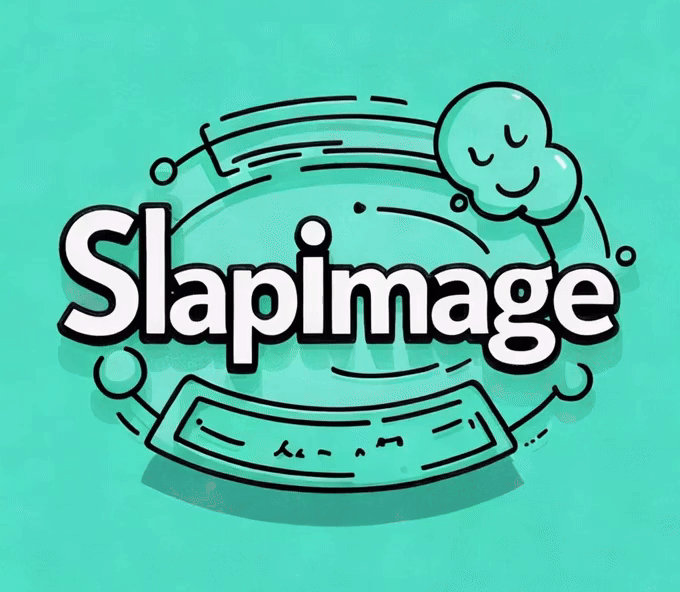
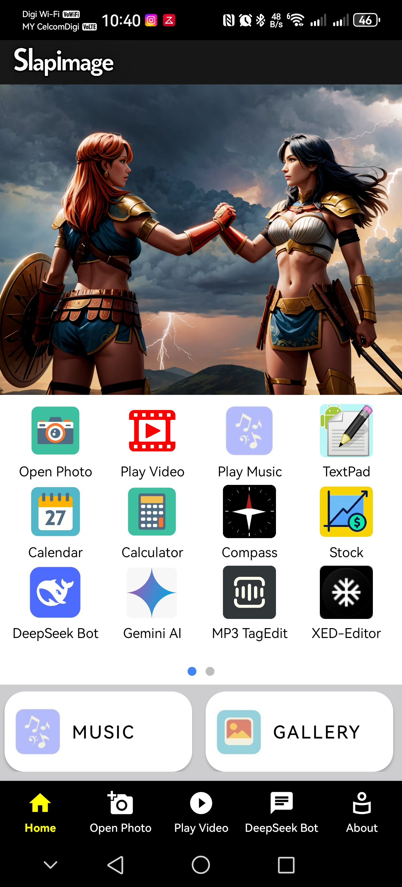
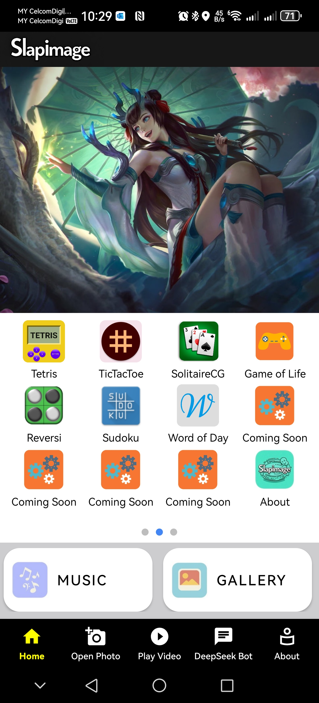
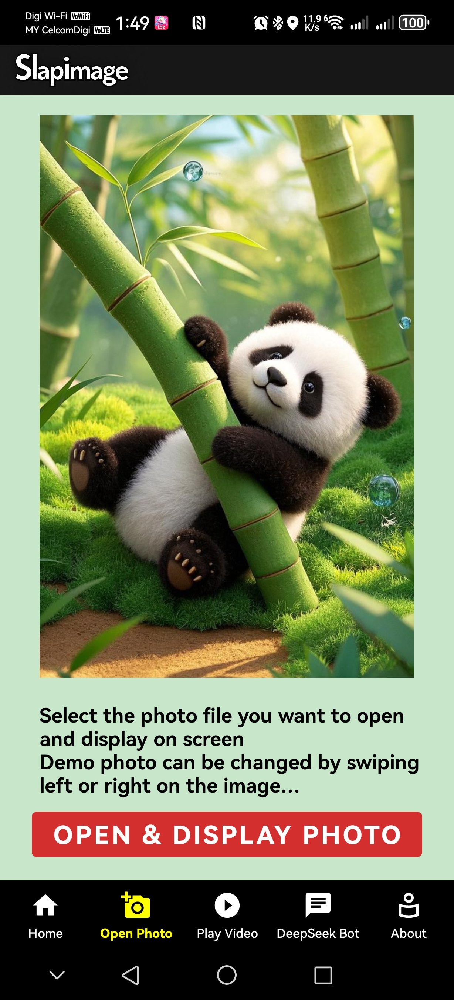
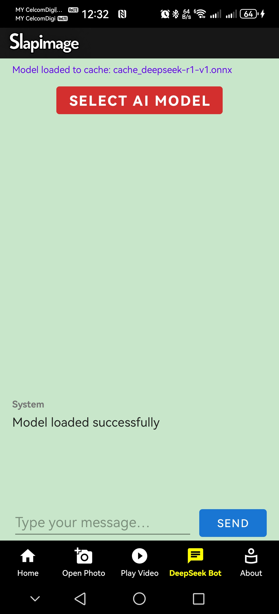
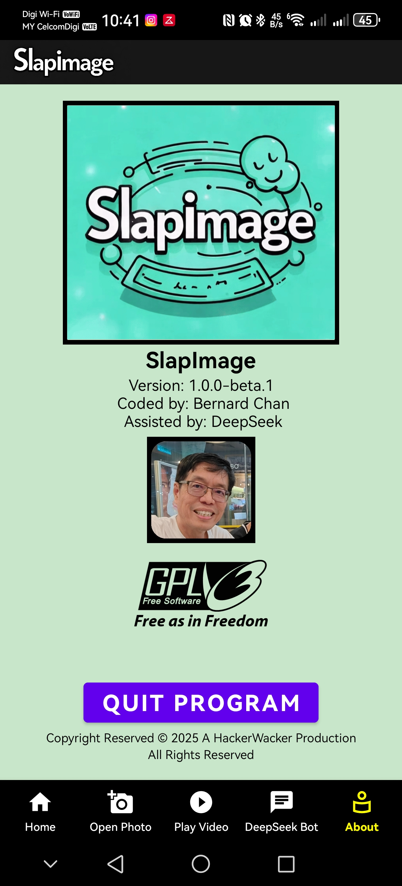

# :mouse: Welcome to SlapImage

<p float="left">
 
</p>

## Table of Contents
- [Description](#scroll-description)
- [APK Download](#gift-apk-download)
- [Development Platform](#computer-development-platform)
- [Build Process](#factory-build-process)
- [Platform Tested](#iphone-platform-tested)
- [Screenshots](#film_strip-screenshots)
- [Chronology of Development Events](#hourglass_flowing_sand-chronology-of-development-events)
- [Unresolvable Bug in Todo List](#beetle-unresolvable-bug-in-todo-list)
- [Incomplete Todo Tasks](#plate_with_cutlery-incomplete-todo-tasks)
- [Buy Me a Coffee](#coffee-buy-me-a-coffee)
- [Changelog](#new-changelog)
- [License](#page_with_curl-license)
- [Feedback and Suggestions](#speech_balloon-feedback-and-suggestions)

## :scroll: Description
<p float="left">
 
</p>
<p>This is my attempt to create a utility Android Apps which is feature-rich and contains useful functions using Android Studio Meerkat with the assistance of DeepSeek (https://www.deepseek.com/). </p>
<p>Some of graphics are generated with Doubao 豆包 (https://www.doubao.com/chat/). </p>
<p>Basically it allows me to personally experience the recent hype of Vibe Coding and whether AI can actually realistically replace software engineers? :grin: </p>

## :gift: APK Download
Try it yourself and I would love to hear your feedback :smiley: :mouse: <br>
- Download [SlapImage-v1.0.0-fdroid-beta.3.apk](https://github.com/chanlhock/SlapImage/releases/tag/v1.0.0-beta.3)

## :computer: Development Platform
SlapImage is developed using:
- old MacBook Air 2017 with Intel Processor.
- Android Studio Meerkat 2024 3.1 Patch 1
- DeepSeek AI for code and activity generation, debug and review
- GitHub Copilot for some minor code review and debug

## :factory: Build Process
- SlapImage build is relatively auto within the Android Studio build environment except libMuPDF.so file generation for Librera which needs special build.
- The following instruction are extracted from a portion of the Librerareader README.md file. (Note: I was not able to build to generate the libMuPDF.so file because my old iMac doesn't support some dependency library files. Ended up i just extracted the libMuPDF.so from the Librera apk and add it in the /scr/main/Libs)
### Required build libs
~~~~
mesa-common-dev libxcursor-dev libxrandr-dev libxinerama-dev libglu1-mesa-dev libxi-dev pkg-config libgl-dev
~~~~
You also need the Android NDK in version 20+
Please ensure to download it using android studio and add the NDK to your PATH.
### Create a keystore
Even if you do not plan to upload a version yourself you need a keystore with a certificate to build.
The keystore needs to be in PKCS12 format.
You can create a keystore in your actual directory using the following call
(replace ALIAS by your alias, it is just a name):
~~~~
keytool -genkey -v -storetype PKCS12 -keystore keystore.pkcs12 -alias ALIAS -keyalg RSA -keysize 2048 -validity 10000
~~~~
Now edit or create the file ~/.gradle/gradle.properties and set following values
(replacing PASSWD by the password you typed while creating the keystore, ALIAS as before and using the path to your
keystore):
~~~~
RELEASE_STORE_FILE=/PATH/TO/YOUR/keystore.pkcs12
RELEASE_STORE_PASSWORD=PASSWD
RELEASE_KEY_PASSWORD=PASSWD
RELEASE_KEY_ALIAS=ALIAS
~~~~
### Librera Build on MuPdf
~~~~
cd Builder
./link_to_mupdf_x.x.x.sh (Change the paths to mupdf and jniLibs folders)
cd ..
./gradlew assembleLibrera
~~~~

### Building for F-Droid for Android
If you wish to build for F-Droid (e.g. not using google services, Internet) you can run the build with
~~~~
cd Builder
./link_to_mupdf_x.x.x.sh
cd ..
./gradlew assembleFdroid
~~~~
F-Droid build does also not need a **google-services.json**

## :iphone: Platform tested:
I have tested mostly my code on:
- Huawei P50 Pro mobile phone running EMUI 14.2.0 (Android 12) 6.6" display (1228 x 2700 pixels).
- Honor 200 mobile phone running Android 15 6.78" display (1224 x 2700 pixels).
- Huawei Mate 30 mobile phone running EMUI 12.0.0 (Android 10) 6.62" display (1080 x 2340 pixels)
  
Testing is also done on a Virtual Phone that I have setup in Android Studio:
- Virtual phone using Pixel 4 skin Android 10 (API 29) 5.7" display (1080 x 2280 pixels)
- Virtual Medium Tablet Android 10 (API 29) 10.05" display (1600 x 2560 pixels)

In addition I have also tested to some extent on:
- Huawei Matepad 12 X Tablet running on Harmony OS 4.2.0 (Android 12) 12" display (1840 x 2800 pixels)\
  [Note: an attempt to develop the apps to cover larger screen size]

## :film_strip: Screenshots
<p float="left">
  
   
  
</p>
<p float="left">
   
  
  
</p>


## :hourglass_flowing_sand: Chronology of Development Events
- 16th Mar 2025: Started Android project SlapImage from scratch _Vibe Coding_ using DeepSeek in Kotlin.
- 20th Mar 2025: Completed the Apps initial view with a running banner on top, follow by rows of grid icons container in the middle and bottom navigation fragment icons.
- 25th Mar 2025: Assistance from DeepSeek to modify code so that the running banner code display transition more smoother and professionally handled.
- 1st Apr 2025: With DeepSeek help clone developed an Apple IOS Apple for SlapImage using Apple xcode platform. Tried to maintain as similar visual look, banner, grid icon and bottom navigation buttons as Android. Successfully emulated for iPad and iPhone.
- 2nd to 14th Apr 2025: Added features of Open Photo, Open & Play Video, Open Text File, simple Calculator, simple Calendar, Game of Life Simulator, Stock Price Checker, Gallery browser and Play MP3 song. 
- 14th Apr 2025: Decision not to continue with Apple xcode apps development due to xcode not able to upload my apps to new iPad Air M3. Some _missing strings_ error that i am not willing to spend further time. Most probably it's an old MacBook Air 2017 issue. Apple really sucks when comes to development using an old machine!#@#@*% :rage:
- 17th Apr 2025:
  - Completed implementing in HomeFragment.kt both horizontal grid icon scroller and two circular indicators below horizontal grid icon scroller with active page's indicator highlighted in blue.
  - SlapImage had reached a point of stable code of functions and features. I proceeded to commit it to GitHub.
- 19th Apr 2025: Added an activity to support Google Gemini AI with DeepSeek generated production ready chat dialog.
- 22nd Apr 2025: Removed API Keys from source code and secured them in local.properties for apps build.
- 24th Apr 2025: Modified and added a simple and feature-rich Music Player from Github. (https://github.com/HarshAndroid/MusicPlayer-Android-Kotlin)
- 25th Apr 2025: Modified and added a tetris game fully built using Jetpack Compose source code from Github. Need to migrate from Material to Material3 to resolve build error. (https://github.com/vitaviva/compose-tetris)
- 2nd May 2025: Modified and added a new calculator from Github. (https://github.com/AyushAgnihotri2025/Calculator)
- 7th May 2025: Successfully modified, fixed bugs and added a TicTacToe from Github. (https://github.com/yamin8000/Dooz )
- 8th May 2025: Release the initial stable version of SlapImage v1.0.0-beta.1 apk. :tada:
- 12th May 2025: Modified and added an MP3 Tag Editor - Metadator from Github. (https://github.com/BobbyESP/Metadator)
- 15th May 2025: Added SolitaireCG from f-droid.org based on Version 4.1 (4010) 2nd May 2025 source tarball. Quite easily ported over eventhough it is in Java instead of Kotlin. (https://f-droid.org/en/packages/net.sourceforge.solitaire_cg/)
- 16th May 2025: 
  - Added SimpleTextEditor from f-droid.org based on Version 1.27.1 2nd May 2025 source tarball. (https://f-droid.org/en/packages/com.maxistar.textpad/)
  - SimpleTextEditor also has source code released at Github. (https://github.com/maxistar/TextPad)
- 17th May 2025: Added MBCompass from f-droid.org based on Version 1.1.5 22nd Apr 2025 source tarball. (https://f-droid.org/en/packages/com.mubarak.mbcompass/)
- 20th May 2025: 
  - Added Xed-Editor from f-droid.org based on Version 3.0.6 (52) 14th May 2025 source tarball. (https://f-droid.org/en/packages/com.rk.xededitor/). 
  - Xed-Editor also has open source at GitHub. (https://github.com/Xed-Editor/Xed-Editor)
- 21st May 2025: Released the updated version of SlapImage v1.0.0-beta.2 apk.
- 5th June 2025: 
  - Succesfully added Librera ebook reader after attempting for 11 days. Librera from f-droid.org based on version 8.9.182-fdroid (6202) 9th Nov 2024 source tarball. (https://f-droid.org/en/packages/com.foobnix.pro.pdf.reader/). 
  - Librera also has open source at Github. (https://github.com/foobnix/LibreraReader).
  - The source code is very complicated and it took me quite a long time to fix the book cover thumbnail and book pages images not showing issue.
- 7th June 2025: 
  - Added DroidZebra (Reversi) from f-droid.org based on Version 1.5.3 (17) 18th June 2016 source tarball. (https://f-droid.org/en/packages/com.shurik.droidzebra/). 
  - DroidZebra can also be found as open source at Github. (https://github.com/alkom/droidzebra).
  - Although this apps is written more than 10 years ago it is quite easily ported over to latest version of Android.
- 8th June 2025: Released the stable updated version of SlapImage v1.0.0-fdroid-beta.3 apk.
- 10th June 2025: 
  - Added OpenBible from f-droid.org based on Version 1.8.0 (29) 14th May 2025 source tarball. (https://f-droid.org/en/packages/com.schwegelbin.openbible/)
  - OpenBible can also be found as open source at Github. (https://github.com/SchweGELBin/OpenBible2)
- 13th June 2025: 
  - Added Sudoku from f-droid.org based on Version 3.2.4 (19) 25th Apr 2025 source tarball. (https://f-droid.org/en/packages/org.secuso.privacyfriendlysudoku/)
  - Sudoku can be found as well as open source at Github. (https://github.com/SecUSo/privacy-friendly-sudoku)
- 14th June 2025:
  - Added another Calculator from f-droid.org based on Version 3.1.2 (33) 22nd Jan 2025 source tarball. (https://f-droid.org/packages/com.marktka.calculatorYou/)
  - Forz Calculator can also be found as open source at Github. (https://github.com/forzzzzz/Calculator-You?tab=readme-ov-file)

## :beetle: Unresolvable Bug in Todo List
- [ ] When OpenBible activity is launched it took a long time before the OpenBible main page is displayed. Based on Logcat there are 808 frames skipped and that main activity is very busy. This long delay also happen when closing the Settings screen. It seems that there is quite a lot of work that the apps needs to do and its code needs to change to run these in the backgrond instead of main.
- [ ] When Xed-Editor activity is launched and user using Alphine for running C++ and Python there is an error of permission denied for proot in the Alphine terminal windows. 
- [X] (Issue fixed 19th Apr 2025) When user pressed the back arrow button at the topbar of StockActivity.kt view, returning back to HomeFragment.kt view there is a large white rectangle covering lower two rows of the grid icon container. This only happens when user enters a Stock Ticker and check the stock price. However, if user uses the phone back button to return to HomeFragment.kt view, the bug doesn't happen. One other observation is that the bug doesn't happen on Android 15 phone. :eyes:
   - Resolution: Added these lines of code to navigate back to MainActivity (which hosts HomeFragment) solved the issue.
```kotlin
     toolbar.setNavigationOnClickListener {
            // Navigate back to MainActivity (which hosts HomeFragment)
            val intent = Intent(this, MainActivity::class.java)
            startActivity(intent)
            super.finish() }   
```
- [X] (Issue fixed 18th Apr 2025) When user clicked Gallery button to launch, SlapImage crashes. :warning: (Issue only specifically occurred on Huawei Matepad 12 X).  ----- 
   - Resolution: The key improvements are: (refer to GalleryActivity.kt for more details)
     - Better null safety checks
     - Huawei-specific MediaStore handling
```kotlin
    val uri = if (Build.MANUFACTURER.equals("huawei", ignoreCase = true)) {
        // Huawei specific URI
        MediaStore.Images.Media.getContentUri("external")
    } else {
        MediaStore.Images.Media.EXTERNAL_CONTENT_URI
    }
```
## :plate_with_cutlery: Incomplete Todo Tasks
- [X] Add an activity to support Google Gemini AI Chat Dialog.
- [X] Improve the MP3 song player features by adapting good open source solution from GitHub.
- [X] Add an activity to support Textris game activity by adapting good open source solution from GitHub.
- [ ] Explore :eye:possibility of creating access of DeepSeek tensorflow lite model locally on device to run the DeepSeek Chat Dialog activity?
  - :pencil:Managed to generate ONNX file from Deepseek R1 model, unsuccessful in proceeding to generate tensorflow lite model. Create a Chat Dialog activity using ONNX model instead. Model able to load but when send message gotten error response. Pending further study and debugging...

## :coffee: Buy Me a Coffee
If you appreciate my work, do support me by...<br>
<a href="https://www.buymeacoffee.com/chanlhock" target="_blank"></a>

## :new: Changelog
- [Releases](https://github.com/chanlhock/SlapImage/releases)
  
## :page_with_curl: License
```
SlapImage is licensed under the GNU General Public License v3.0 
Permissions of this strong copyleft license are conditioned on making  
available complete source code of licensed works and modifications,  
which include larger works using a licensed work, under the same  
license. Copyright and license notices must be preserved. Contributors  
provide an express grant of patent rights.
```
See the [GNU General Public License](LICENSE.txt) for more details.
* [Third-Party License](THIRDPARTY.md)


## :speech_balloon: Feedback and Suggestions
For any feedback or suggestions, feel free to contact me via email:\
:email: chanlhock@gmail.com :mouse:

